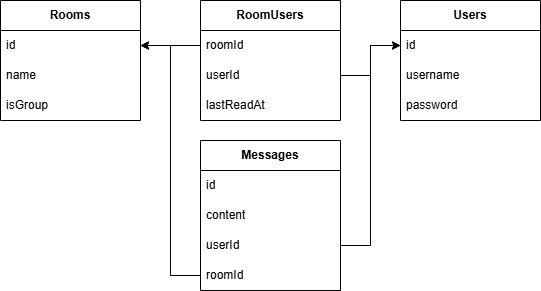

# 💬 Real-time Chat Application | 即時聊天室網站

> A modern real-time chat application built with Node.js, React, and Socket.IO
> 
> 使用 Node.js、React 和 Socket.IO 實作的即時聊天網站
> 
> https://www.pin-chun.it.com/

## 🌟 Features | 功能特色

### 🔐 Authentication & User Management | 身份驗證與用戶管理
- [x] **User Registration & Login** | 用戶註冊與登錄
- [x] **JWT Token Authentication** | JWT 身份驗證
- [x] **Password Encryption (bcrypt)** | 密碼加密 (bcrypt)
- [x] **User Search & Discovery** | 用戶搜索

### 💬 Chat Features | 聊天功能
- [x] **Real-time Messaging** | 即時消息傳送
- [x] **Group Chat Rooms** | 群組聊天室
- [x] **One-on-One Direct Messages** | 一對一私訊
- [x] **Unread Message Count** | 未讀訊息計數
- [x] **Read Status Tracking** | 訊息已讀狀態(尚未完成)

### 🏠 Room Management | 聊天室管理
- [x] **Create Group Rooms** | 創建群組聊天室
- [x] **Invite Users to Rooms** | 邀請用戶加入聊天室
- [x] **Room Member List** | 聊天室成員列表(尚未完成)
- [x] **Auto-create Direct Message Rooms** | 自動創建私訊房間

### 📱 User Experience | 用戶體驗
- [x] **Responsive Mobile Design** | 響應式前端設計
- [x] **Real-time Connection Status** | 即時連線狀態(尚未完成)
- [x] **Auto-scroll to Latest Messages** | 自動滾動至最新消息
- [x] **Message Timestamps** | 顯示傳訊息時間

## 🏗️ System Architecture | 系統架構

### Technology Stack | 技術棧

#### Backend | 後端
- **Runtime:** Node.js
- **Framework:** Express.js
- **Database:** PostgreSQL with Sequelize ORM
- **Real-time:** Socket.IO
- **Authentication:** JWT (JSON Web Tokens)
- **Security:** bcrypt for password hashing

#### Frontend | 前端
- **Framework:** React
- **Build Tool:** Vite
- **Styling:** CSS3
- **HTTP Client:** Axios
- **Real-time:** Socket.IO Client

### Database Schema | 資料庫架構

```sql
-- Users Table | 用戶
Users {
  id: SERIAL PRIMARY KEY
  username: VARCHAR(255) UNIQUE NOT NULL
  password: VARCHAR(255) NOT NULL
  createdAt: TIMESTAMP
  updatedAt: TIMESTAMP
}

-- Rooms Table | 聊天室
Rooms {
  id: SERIAL PRIMARY KEY
  name: VARCHAR(255) NULL          -- NULL for direct messages
  isGroup: BOOLEAN DEFAULT false   -- true for group chats
  createdAt: TIMESTAMP
  updatedAt: TIMESTAMP
}

-- Messages Table | 訊息
Messages {
  id: SERIAL PRIMARY KEY
  content: TEXT NOT NULL
  userId: INTEGER REFERENCES Users(id)
  roomId: INTEGER REFERENCES Rooms(id)
  createdAt: TIMESTAMP
  updatedAt: TIMESTAMP
}

-- Room Users Junction Table | 聊天室用戶關聯表
RoomUsers {
  id: SERIAL PRIMARY KEY
  roomId: INTEGER REFERENCES Rooms(id)
  userId: INTEGER REFERENCES Users(id)
  lastReadAt: TIMESTAMP NULL       -- For unread count calculation
  createdAt: TIMESTAMP
  updatedAt: TIMESTAMP
}
```


### API Endpoints | API

#### Authentication | 身份驗證
```
POST   /api/register          - Register new user
POST   /api/login            - User login
```

#### Rooms | 聊天室
```
GET    /api/rooms            - Get user's rooms with unread counts
POST   /api/rooms            - Create new group room
POST   /api/rooms/direct     - Create/get direct message room
POST   /api/rooms/:id/invite - Invite users to room
POST   /api/rooms/:id/mark-read - Mark room as read
```

#### Messages | 消息
```
GET    /api/rooms/:id/messages - Get room messages
POST   /api/rooms/:id/messages - Send message to room
```

#### Users | 用戶
```
GET    /api/users/search     - Search users by username
```
<!--
### Real-time Events | 即時事件

#### Socket.IO Events | Socket.IO 事件

## 🔧 Key Implementation Details | 核心實現細節

### Real-time Communication | 即時通訊
- **Socket.IO Integration:** Seamless real-time messaging with automatic reconnection
- **Room Management:** Users automatically join their chat rooms on connection
- **Message Broadcasting:** Efficient message delivery to room participants only
 - **Connection Handling:** Robust error handling and connection status management 

### Database Design | 資料庫設計
- **Many-to-Many Relationships:** Users can belong to multiple rooms via junction table
- **Message Threading:** Messages are properly linked to rooms and users
- **Unread Count Calculation:** Efficient tracking using lastReadAt timestamps
- **Optimized Queries:** SQL queries optimized for chat room listing and message retrieval -->
<!--
### Security Features | 安全特性
- **JWT Authentication:** Stateless authentication with secure token handling
- **Password Encryption:** bcrypt hashing with salt rounds for password security
- **Room Access Control:** Users can only access rooms they belong to
- **Input Validation:** Comprehensive validation for all API inputs

### Performance Optimizations | 性能優化
- **Database Indexing:** Optimized indexes for frequent queries
- **Connection Pooling:** Efficient database connection management
- **Real-time Events:** Minimal payload for Socket.IO events
- **Frontend State Management:** Efficient React state updates for chat UI

## 🔮 Future Enhancements | 未來改進

### Planned Features | 計劃功能
- [ ] **Message Pagination & Infinite Scroll** | 消息分頁與無限滾動
- [ ] **File Upload & Image Sharing** | 文件上傳與圖片分享
- [ ] **Message Reactions & Emojis** | 消息反應與表情符號
- [ ] **User Online Status** | 用戶在線狀態
- [ ] **Message Search** | 消息搜索功能
- [ ] **Push Notifications** | 推送通知
- [ ] **Dark Mode Theme** | 暗色主題模式
- [ ] **Message Encryption** | 消息加密


### Technical Improvements | 技術改進
- [ ] **Redis for Session Management** | Redis 會話管理
- [ ] **Message Queue (RabbitMQ)** | 消息隊列
- [ ] **CDN for File Storage** | CDN 文件存儲
- [ ] **Automated Testing Suite** | 自動化測試套件
- [ ] **Performance Monitoring** | 性能監控
- [ ] **API Rate Limiting** | API 限流
- [ ] **Database Migrations** | 資料庫遷移
- [ ] **TypeScript Migration** | TypeScript 遷移
-->
